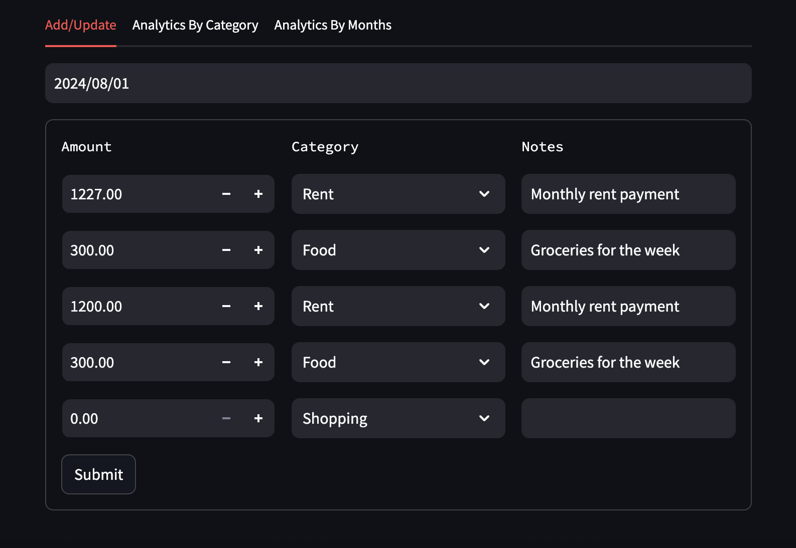
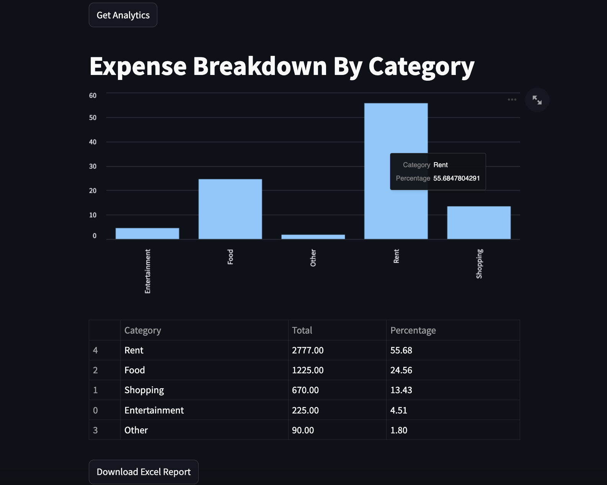
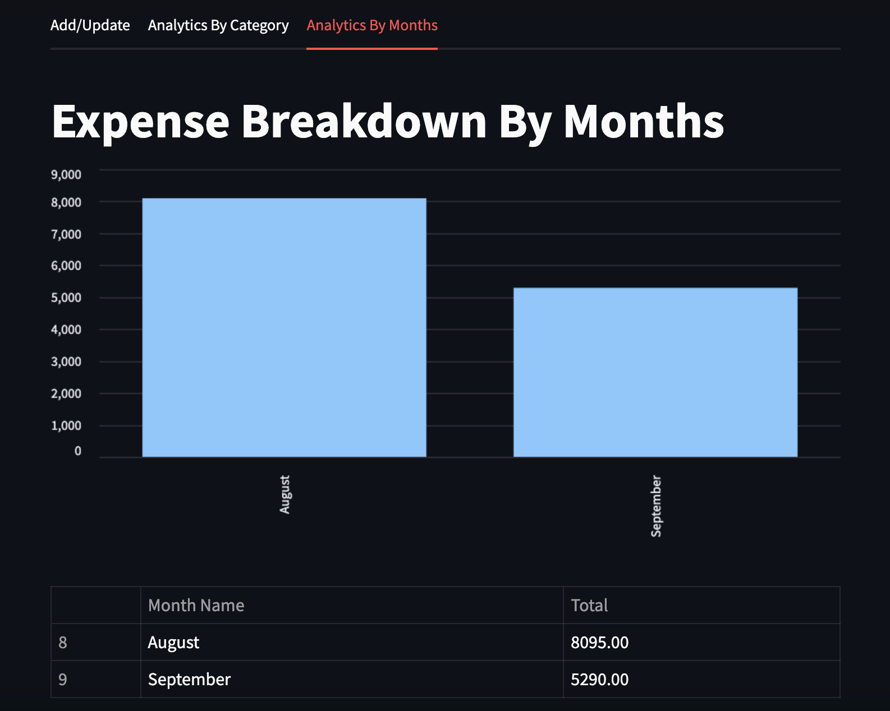

# Expense Management System
A web-based application for managing and analyzing personal expenses. Built with Streamlit (frontend) and FastAPI (backend), the app supports interactive visualizations and data export capabilities.

---

## Features
- Add and update daily expenses
- View analytics by:
  - Category
  - Month
- Visualize data using bar charts and tables
- Export analytics to Excel (.xlsx)

---

## Screenshots
### Add / Update Expenses


### Analytics by Category


### Analytics by Month



---

## Project Structure
- `frontend/`: Contains the Streamlit application code.
- `backend/`: Contains the FastAPI backend server code.
- `tests/`: Contains the test cases for both frontend and backend.
- `requirements.txt`: Lists the required Python packages.
- `README.md`: Provides an overview and instructions for the project.

---

## Setup Instructions

1. **Clone the repository**:
   ```bash
   git clone https://github.com/yourusername/expense-management-system.git
   cd expense-management-system
   ```
2. **Install dependencies:**:   
   ```commandline
    pip install -r requirements.txt
   ```
3. **Run the FastAPI backend server:**:   
   ```commandline
    uvicorn server.server:app --reload
   ```
4. **Run the Streamlit frontend:**:   
   ```commandline
    streamlit run frontend/app.py
   ```
   > Make sure the FastAPI backend is running before launching the Streamlit frontend


